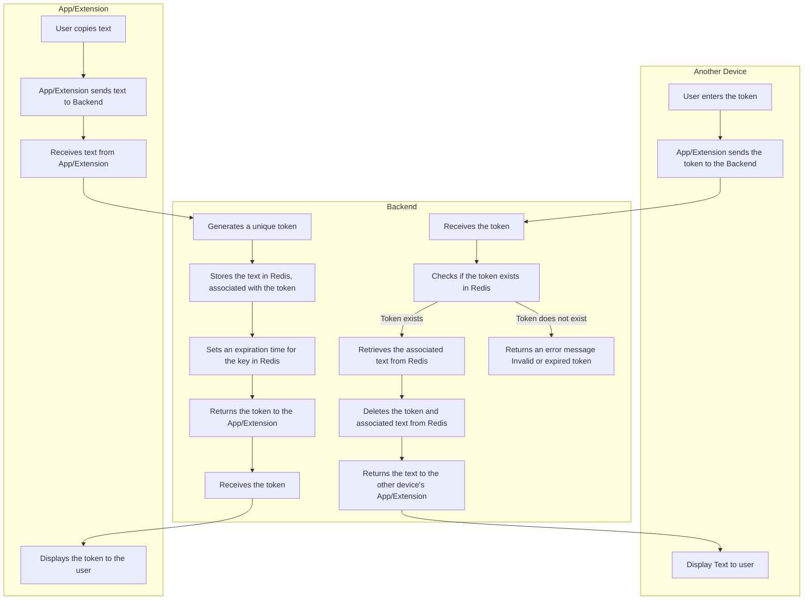

# Clipboard Sync

Clipboard Sync is a multi-platform application that allows you to sync your clipboard across devices using a temporary token. The project consists of three main components: a backend server, a Chrome extension, and a mobile app.




## Table of Contents

- [Backend](#backend)
  - [Setup](#setup)
  - [Running the Server](#running-the-server)
- [Chrome Extension](#chrome-extension)
  - [Setup](#setup-1)
  - [Usage](#usage)
- [Mobile App](#mobile-app)
  - [Setup](#setup-2)
  - [Running the App](#running-the-app)

## Backend

The backend is built using FastAPI and Redis for storing clipboard data temporarily.

### Setup

1. Clone the repository:
    ```sh
    git clone https://github.com/yourusername/clipboard-sync.git
    cd clipboard-sync/backend
    ```

2. Create a [.env](http://_vscodecontentref_/0) file in the [backend](http://_vscodecontentref_/1) directory with the following content:
    ```env
    REDIS_HOST=localhost
    REDIS_PORT=6379
    EXPIRY_TIME=300
    ```

3. Install the required dependencies:
    ```sh
    pip install -r requirements.txt
    ```

### Running the Server

1. Start the Redis server:
    ```sh
    docker-compose up -d redis
    ```

2. Start the FastAPI server:
    ```sh
    uvicorn app.main:app --host 0.0.0.0 --port 8000
    ```

The backend server will be running at `http://localhost:8000`.

## Chrome Extension

The Chrome extension allows you to sync your clipboard with the backend server.

### Setup

1. Open Chrome and go to [chrome://extensions/](http://_vscodecontentref_/2).
2. Enable "Developer mode" in the top right corner.
3. Click "Load unpacked" and select the [chrome-extension](http://_vscodecontentref_/3) directory.

### Usage

1. Click on the Clipboard Sync extension icon.
2. Click "Copy & Generate Token" to copy the current clipboard text and generate a token.
3. Enter the token in the "Enter token" field and click "Retrieve Clipboard" to retrieve the clipboard text.

## Mobile App

The mobile app is built using React Native and allows you to sync your clipboard with the backend server.

### Setup

1. Navigate to the [mobile](http://_vscodecontentref_/4) directory:
    ```sh
    cd ../mobile
    ```

2. Install the required dependencies:
    ```sh
    npm install
    ```

### Running the App

1. Start the Expo development server:
    ```sh
    npm start
    ```

2. Use the Expo Go app on your mobile device to scan the QR code and run the app.
